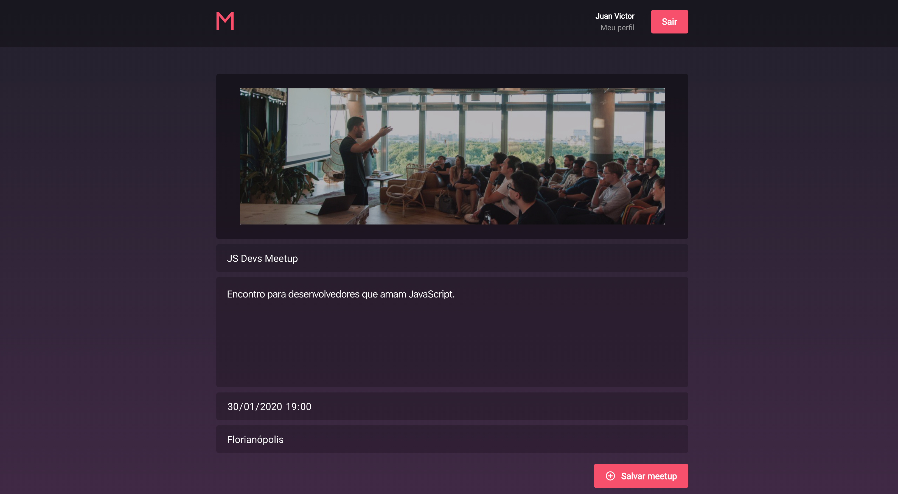

# Meetapp

Projeto final para certificação no bootcamp da <a href="https://rocketseat.com.br/" target="blank">Rocketseat</a>.

<p align="center">
  
</p>

Link do certificado de aprovação: https://skylab.rocketseat.com.br/api/files/certificates/2460294a-268b-4f11-bf48-65929572d81d.pdf

O Meetapp é uma aplicação que permite aos usuários participar, criar e gerenciar encontros (meetups).

A versão web foi desenvolvida para os organizadores poderem criar e gerenciar seus meetups, enquanto a versão mobile serve para os usuários gerenciarem suas participações em meetups.

Todo o layout da web e mobile foram construídos a partir de modelos do Sketch (disponíveis nas pastas dos projetos).

## Screenshots Web

<p align="center">
  
  
  
  
  
  
  
</p>

## Screenshots Mobile

<div style="float: left;">
  
  
  
  
  
  
</div>

## Passo a passo para executar a aplicação

### 1. Meetapp Server

* Acesse a pasta **backend** do projeto.
* Nesta pasta há um arquivo chamado `.env.sample`, copie o conteúdo deste arquivo, crie um arquivo no mesmo diretório com o nome `.env`, cole e salve o conteúdo (`cp .env.sample .env`).
* Com o <a href="https://docs.docker.com/install/" target="blank">Docker</a> e <a href="https://docs.docker.com/compose/install/" target="blank">Docker Compose</a> instalados, execute no terminal:

```
docker-compose up
```

:white_check_mark: **O servidor já estará rodando e pronto para receber requisições da api.**

Foram implementados alguns testes para User e Session, só para botar o conteúdo em prática ;)

Caso queira rodar testes, execute no terminal:

```
docker-compose exec web yarn test
```

### 2. Meetapp Web

* Abra outro terminal e navegue até pasta **frontend** deste projeto, então execute:

```
yarn
```
* Em seguida:
```
yarn start
```

É necessário ter o <a href="https://nodejs.org/" target="blank">Node</a> instalado em sua máquina. Caso não tenha o <a href="https://yarnpkg.com/" target="blank">yarn</a> pode substituir o comando por `npm`.

A aplicação ficará acessível no seu navegador em http://localhost:3000

### 3. Meetapp Mobile

> :warning: **A versão mobile foi desenvolvida e testada somente no emulador do iOS. O funcionamento no Android não é garantido.**

> Antes de tudo certifique-se de ter o ambiente react-native devidamente configurado em sua máquina (<a href="https://docs.rocketseat.dev/ambiente-react-native/introducao">Guia do ambiente</a>)

> Para o iOS este projeto utiliza o *CocoaPods*. Caso ocorra algum erro relacionado você terá de instalá-lo manualmente (https://cocoapods.org/)

* Acesse a pasta **mobile** deste projeto em um novo terminal e execute:

```
yarn
```
* Em seguida:

```
cd ios && pod install
```

* Finalmente, volte para a pasta **mobile** e execute:

```
react-native run-ios
```
